# Development of Credit Risk Model for a Finance company


[](https://pandas.pydata.org/)
[](https://numpy.org/)
[](https://matplotlib.org/)
[](https://seaborn.pydata.org/)
[](https://scikit-learn.org/)
[](https://xgboost.readthedocs.io/)
[](https://shap.readthedocs.io/)
[](https://optuna.org/)
[](https://github.com/fmfn/BayesianOptimization)
[](https://imbalanced-learn.org/)


## Overview

A Non-Banking Financial Company (NBFC) based in India is partnering with a leading AI service provider — to develop a sophisticated credit risk model. The goal is to build a robust predictive model and an associated credit scorecard that categorizes loan applications into **Poor, Average, Good, and Excellent** categories based on patterns similar to the CIBIL scoring system.

---

## 🔍 Project Scope

### **1. Model Development**
- Develop a predictive machine learning model based on historical loan and default data from the Finance company.
- Build a dataset pipeline that ingests customer information, loan details, and bureau credit attributes.

### **2. Credit Scorecard Creation**
- Produce a scoring mechanism that assigns credit categories (Poor, Average, Good, Excellent).
- Translate model outputs into actionable business-friendly scores suitable for credit underwriting.

### **3. Streamlit UI Application**
- Build a user-friendly Streamlit application.
- The UI will enable loan officers to input borrower demographics, loan parameters, and bureau data to:
  - Predict default probability
  - Output an interpretable credit rating

---
## Architecture: Component Diagram

```mermaid
graph TD

    subgraph Data_Layer
        A1[📁 bureau_data.csv]
        A2[📁 customers.csv]
        A3[📁 loans.csv]
    end

    subgraph Backend
        B1[(Data Preprocessing)]
        B2[(Model Training)]
        B3[(Model Evaluation)]
        B4[(Scorecard Creation)]
        B5[(Export Model Artifact)]
    end

    subgraph UI_Layer
        C1[📱 Streamlit Web App]
        C2[🧑‍💻 User Inputs]
        C3[📊 Prediction Output]
    end

    A1 --> B1
    A2 --> B1
    A3 --> B1

    B1 --> B2
    B2 --> B3
    B3 --> B4
    B4 --> B5

    B5 --> C1
    C1 --> C2
    C1 --> C3

```


## 📁 Project Structure
```markdown
CRM/
├── app/
│   ├── main.py                      # Main application script (if applicable)
│   ├── prediction_helper.py         # Helper functions for prediction
│   ├── artifacts/
│   │   └── model_data.joblib         # Trained model artifact
│   └── __init__.py
│
├── credit_risk_modelling.ipynb       # Jupyter Notebook for model development
├── requirements.txt                  # Python dependencies
├── dataset/                         # Dataset (not committed to GitHub)
│   ├── bureau_data.csv
│   ├── customers.csv
│   └── loans.csv
├── images/                          # Supporting images
│   ├── 1.jpg
│   ├── 2.jpg
│   └── ...
├── .gitignore                       # Files/folders to ignore in Git
└── README.md                        # Project documentation
```

> **Note:** The `dataset/` folder is excluded from the GitHub repository using `.gitignore`. You need to add the data locally for the model to run.

---
### Project overview
Datasets
   |
   V
Data Preprocessing → EDA
   |                    |
   V                    |
Model Training ← Hyperparameter Tuning
   |
   V
Model Evaluation
   |
   V
Scorecard Creation
   |
   V
Streamlit App → Prediction Output

## 🧠 Scope of Work

### **1. Model Development**
- Build a predictive model using Lauki Finance’s historical loan data.  
- Handle class imbalance using techniques like under-sampling and resampling.  
- Train and evaluate models such as Logistic Regression, Random Forest, and XGBoost.

### **2. Scorecard Creation**
- Translate model outputs into a **credit scorecard**.  
- Categorize credit quality into:
  - **Poor**
  - **Average**
  - **Good**
  - **Excellent**

### **3. Streamlit UI Application**
- A web interface where loan officers can input:
  - Borrower demographics  
  - Loan details  
  - Bureau credit information  
- The app returns:
  - Default probability  
  - Credit score rating

---

## 🚀 Installation & Setup

### **1. Clone the Repository**
```bash
git clone https://github.com/<YOUR_USERNAME>/credit-risk-modeling.git
cd credit-risk-modeling
```
2. Create and Activate Python Virtual Environment
```bash
python3 -m venv venv
source venv/bin/activate
```
3. Install Dependencies
```bash
pip install -r requirements.txt
```
### 💡 Future Enhancements

-Build and deploy a Streamlit web application for real-time loan risk predictions.

-Add automated retraining with new data.

-Publish to Heroku / AWS / Render for production use.
